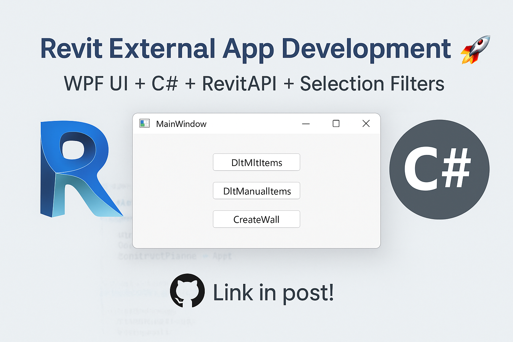

Sure! Here's your **Revit External Application README**, fully restructured in the **GitHub portfolio style** with badges, screenshot section, and clean formatting — ready to paste into your repository:

---

 
 

<h2 align="center">🏗️ Here We Go - Revit External Application</h2>

A **Revit Add-in** built with **WPF (XAML)** and the **Revit API**, focused on selecting and modifying model elements in a user-friendly interface.

<a href="https://github.com/bezawy/Here-We-Go-Revit-App"><strong>➥ View Project on GitHub</strong></a>

---

### 📸 Demo Screenshots

> Screenshots of the application UI inside Revit:

---

## 📝 Overview

This is a **Revit External Application** written in **C#**, **WPF**, and the **Revit API**, designed to simplify element selection and deletion for Revit users.

No deep programming knowledge required — this tool is meant to be **plug and play** for designers and beginners!

---

## 📥 How to Download and Run

### ✅ Prerequisites

Before you begin, make sure you have:

- ✅ Autodesk Revit (Tested on 2024)
- ✅ Visual Studio (Community Edition recommended)
- ✅ .NET Framework 4.8

[Download Visual Studio here](https://visualstudio.microsoft.com/)

---

### 🚀 Steps to Run Locally

1. **Download the Project**
    - Click the green `Code` button and choose `Download ZIP`.
    - Extract the ZIP file.

2. **Open in Visual Studio**
    - Open Visual Studio → `File > Open > Project/Solution`
    - Locate and open the `.sln` file.

3. **Build the Solution**
    - Make sure `RevitAPI.dll` and `RevitAPIUI.dll` are referenced properly.
    - `Build > Build Solution`

4. **Create the .addin File**
    - Point the `.addin` file to your compiled `.dll` path.
    - Place it in `%AppData%\Autodesk\Revit\Addins\2024\`.

5. **Run It Inside Revit**
    - Open Revit → You’ll find a tab called **"Here We Go!"**

---

## 🎮 How to Use the Application

| **Button**             | **Function**                                         |
|------------------------|------------------------------------------------------|
| `Delete Manual Item`    | Manually select and delete a single element         |
| `Delete Multiple Items` | Select multiple elements using rectangle selection  |
| `Create Wall`           | *(Coming Soon)* Programmatically adds a wall        |

---

## 🔍 Code Breakdown

### 🖼️ `MainWindow.xaml`
- Builds the WPF UI with buttons for user interaction.

### ⚙️ `MainWindow.xaml.cs`
- Handles button clicks and connects to Revit via `ExternalEvents`.

### 📦 `GenericSelections.cs`
- Provides a reusable element selection filter (by category, etc).

### 🔁 `ExternalEventHandlers`
- Two handlers control:
  - Manual deletion of selected item
  - Deletion of multiple items using selection box

---

## 🛠️ Common Issues

**🔸 Nothing Happens After Click**  
✔ Ensure elements are selected properly and Revit window is active.

**🔸 Error: Transactions outside valid API context**  
✔ This is handled by `ExternalEvent`, but ensure Revit is not busy.

**🔸 .addin File Doesn't Work**  
✔ Double-check the path to your compiled DLL in the `.addin` file.

---

## 🤝 Contributing

Want to improve this project or learn more?

- Fork the repo
- Add features or refactor code
- Submit a pull request!

---

## 🏆 Credits

Created by **[Muhamed H.Bezawy](https://linkedin.com/in/mohamed-h-bezawy)**  
Inspired by a passion for learning **Revit API** and building smart tools.

---

## 📫 Contact

If you want to reach out:

- 📩 [LinkedIn](https://www.linkedin.com/in/mohamed-h-bezawy)
- 🐦 [Twitter](https://x.com/albezawy)
- 📺 [YouTube Channel](https://www.youtube.com/@mrbezawy9704)

---

## 🧾 License

This project is **free to use** and does not require a license.

---

## 🚀 Let’s build smarter Revit tools — *"Here We Go!"*

---

Would you like me to also generate the `.addin` file template for you now?
